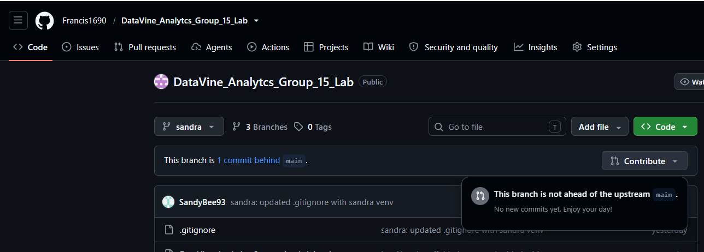

# DataVine Analytics

- Group 15 Project involving analyses: Wine Classification Agricultural, Feed Recommendation, Regional Crime Pattern Analysis

## Setting up project

1. Clone the repository

    ```bash
    git clone https://github.com/Francis1690/DataVine_Analytcs_Group_15_Lab.git
    ```

2. Create a virtual environment

- `Using Python`

- The `.venv` is my prefered naming, you can name it anything e.g., `sandra` | `.sandra` | `anything`

    ```bash
    python -m venv .venv
    ```

- Activate the virtual environment

    ```bash
    .venv\Scripts\Activate.ps1
    ```

    or 

    - your own virtual name

    ```bash
    anything\Scripts\Activate.ps1
    ```

- Once you have done those, there is a file called `requirements.txt` that has projects modules already, you don't need to worry about what packages you need to install just these one command and you are set to go

    ```bash
    pip install -r requirements.txt
    ```

- Happy coding ❤️

### Collaboration rules

- When you first open your local development

- Visit the remote the repository, under branches and check the latest update
- click on it and ensure the branch is not `commits` ahead/behind `main`

- Something like this in the screenshot


- Once you've ensured main is not behind, in your local development run this commands inside this project

1. `git checkout main`
2. `git pull origin main`
3. `git checkout -b <your_github_user_name>-<action>(e.g., fix | feature | refact | doc)`
    - example `git checkout -b benaloo-feature`

- Happy coding ❤️

## You've finished your coding part

1. `git status`
2. `git add .` or `git add <name_of_file>`

3. Note: use your own user.name
    . `git commit -m "benAloo(feature): <your_message_here>`

4. `git push origin benaloo-feature`

### Acknowledgement

- The following contributed to this repository, check out their works in their repositories

- [Sandybee93](https://github.com/Sandybee93)
- [Francis1690](https://github.com/Francis1690)
- [Crayons001](https://github.com/Crayons001)
- [Nyamanyi222](https://github.com/Nyamanyi222)
- [benAloo](https://github.com/benAloo)
